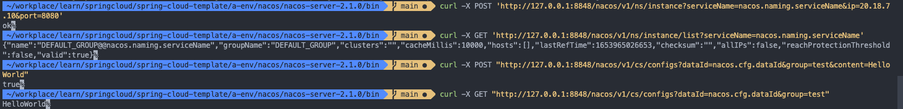

# 环境配置
## 官方文档
[nacos官网](https://nacos.io/zh-cn/index.html)
[nacos-examples](https://github.com/nacos-group/nacos-examples)

## 下载Nacos
下载地址： https://github.com/alibaba/nacos/releases
下载文件：https://github.com/alibaba/nacos/releases/download/2.1.0/nacos-server-2.1.0.zip

## 配置环境
1. 下载nacos-server-2.1.0.zip
2. 解压到`a-env/nacos/nacos-server/2.1.0`
3. nacos脚本目录：`a-env/nacos/nacos-server-2.1.0/bin/`

## 访问nacos
1. 启动nacos：`sh startup.sh -m standalone`
2. 地址：http://127.0.0.1:8848/nacos/index.html
3. 账户：nacos/nacos
4. 关闭nacos：`sh shutdown.sh`


curl -X POST 'http://127.0.0.1:8848/nacos/v1/ns/instance?serviceName=nacos.naming.serviceName&ip=20.18.7.10&port=8080'

# 服务注册&发现和配置管理
## 服务注册
```bash
curl -X POST 'http://127.0.0.1:8848/nacos/v1/ns/instance?serviceName=nacos.naming.serviceName&ip=20.18.7.10&port=8080'
```

## 服务发现
```bash
curl -X GET 'http://127.0.0.1:8848/nacos/v1/ns/instance/list?serviceName=nacos.naming.serviceName'
```
## 发布配置
```bash
curl -X POST "http://127.0.0.1:8848/nacos/v1/cs/configs?dataId=nacos.cfg.dataId&group=test&content=HelloWorld"
```

## 获取配置
```bash
curl -X GET "http://127.0.0.1:8848/nacos/v1/cs/configs?dataId=nacos.cfg.dataId&group=test"
```

命令测试结果如下：

