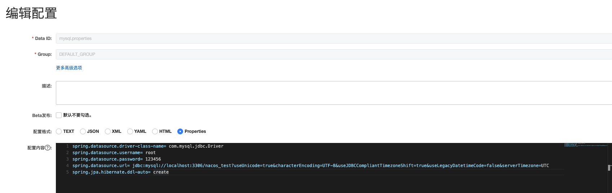

# 说明
## mysql-example
1. 在nacos的配置列表中增加名为`mysql.properties`的配置文件，内容如下
```properties
spring.datasource.driver-class-name= com.mysql.jdbc.Driver
spring.datasource.username= root
spring.datasource.password= 123456
spring.datasource.url= jdbc:mysql://localhost:3306/nacos_test?useUnicode=true&characterEncoding=UTF-8&useJDBCCompliantTimezoneShift=true&useLegacyDatetimeCode=false&serverTimezone=UTC
spring.jpa.hibernate.ddl-auto= create
```



2. 配置完成后启动app

> 使用nacos的yaml文件配置会莫名其妙的读不到配置文件，目前还未找到问题所在。

### mysql.yaml
1. 在nacos中配置名为`mysql.yaml`的配置文件，内容如下
```yaml
spring:
  datasource:
    driver-class-name: com.mysql.jdbc.Driver
    username: root
    password: 123456
    url: jdbc:mysql://localhost:3306/nacos_test?useUnicode=true&characterEncoding=UTF-8&useJDBCCompliantTimezoneShift=true&useLegacyDatetimeCode=false&serverTimezone=UTC
  jpa:
    hibernate:
      ddl-auto: create
```
2. 在APP中加入注解：@NacosPropertySource(dataId = "mysql.yaml")
3. 启动APP会报错，未找到原因

# 关于升级nacos版本
## 测试升级到0.2.10版本
测试升级到0.2.10版本，启动会报错，找到如下issue，发现nacos不支持spring boot 2.4.x+版本

[升级Spring 2.4.1 ConfigurationBeanFactoryMetadata 找不到 #4554](https://github.com/alibaba/nacos/issues/4554)

## 升级到0.2.11-beta版本解决上述问题